# Summer Internship - Anomaly Detection Project Report

**Author**: Sahil  
**Organization**: ICFOSS  
**Date**: July 2026

## 1. Introduction
Continuous and reliable monitoring is critical for accurate automated water level management. This project explores the development of a remote monitoring node deployed for a residential water tank (4.5m height) at Oceanus Bluemount Apartment, using the low-cost HLK-LD2413 mmWave sensor paired with a LoRa-E5 (STM32WLE5) microcontroller. 

To overcome the challenges of remote IoT deployments—specifically power limitations and bandwidth constraints—this project adopts an Edge AI (TinyML) paradigm. By shifting the processing power directly to the sensor node, we can ensure robust, intelligent operation without heavily relying on constant cloud connectivity.

## 2. Existing System and Limitations
Traditional approaches to remote water level monitoring typically transmit raw sensor data over networks like LoRaWAN to a centralized cloud server for cleaning and processing. This architecture presents several significant issues:

* **Sensor Unreliability**: In real-world conditions, sensors like the HLK-LD2413 are prone to hardware glitches. Surface turbulence, signal scattering, or physical vibration often cause the sensor to report transient spikes or sustained "drop-to-zero" flatlines, severely compromising data integrity.
* **Inefficient Bandwidth Usage**: Transmitting all raw, noisy data (including obvious hardware errors) wastes extremely limited LoRaWAN bandwidth.
* **High Power Consumption**: Constant radio transmissions to send uncompressed, raw data rapidly drain the battery of remote, off-grid devices.
* **Latency in Fault Detection**: Relying on the cloud to clean data means anomalies are only detected after transmission, preventing the edge device from taking immediate corrective action or intelligently altering its reporting behavior.

## 3. Project Objectives
To resolve the limitations of traditional cloud-dependent architectures, this project aims to build a robust, intelligent Edge AI pipeline with the following objectives:

* **Edge-Level Anomaly Detection**: Develop and deploy an Autoregressive Multi-Layer Perceptron (AR-MLP) model directly on the STM32WLE5 microcontroller to classify sensor hardware faults and data anomalies in real-time before transmission.
* **Real-time Data Imputation**: Implement an autoregressive model capable of predicting and filling in missing water level data locally during prolonged sensor outages.
* **Bandwidth and Power Optimization**: Compress the cleaned data, predictions, and anomaly status into a minimal LoRaWAN payload. This significantly reduces the required transmission frequency, saving bandwidth and extending the operational battery life of the sensor node.

---

## 4. Hardware & Software Specifications

The project relies on a carefully selected technology stack to achieve low-power edge inference and reliable connectivity:

**Hardware Components**
*   **Microcontroller / Radio:** LoRa-E5 (STM32WLE5JC) featuring an ARM Cortex-M4 core, 256 KB Flash, and 64 KB SRAM.
*   **Sensor:** HLK-LD2413 24GHz Millimeter Wave (mmWave) Radar.
*   **Power Supply:** Standard Li-Ion/Li-Po battery with ADC monitoring for voltage level reporting.

**Software & Frameworks**
*   **Edge AI Toolchain:** STMicroelectronics STM32Cube.AI (for converting and deploying the neural network to the STM32 MCU).
*   **Model Training:** Python, TensorFlow / Keras (with STM32Cube.AI Converter & Optimization Tool).
*   **Firmware Development:** STM32CubeIDE, C/C++.
*   **Network Server:** ChirpStack v3 (for LoRaWAN payload decoding and data routing).

---

### High-Level System Architecture

The following diagram illustrates the end-to-end data flow of the project. It demonstrates how raw distance measurements from the physical sensor are acquired by the edge MCU, processed locally through a neural network, and finally packed into a minimal payload for transmission over the LoRaWAN network to the cloud dashboard.

**Detailed Edge Device Operations (`E5_hlk_RLS` Firmware):**
*   **Sensor Acquisition Layer:** The `hlk_ld2413.c` driver manages the UART interface, parsing incoming byte streams from the sensor to extract the raw target distance. Concurrently, the edge node's internal ADC periodically samples the system battery voltage (`readBatteryLevel`).
*   **AI Inference Layer:** Managed by the ST X-CUBE-AI wrapper, the `STM32CubeAI_Studio_AI_Process()` function is invoked on a set interval. It takes the raw target distance, the sensor's native error code, and historical lags as inputs, passing them through the dual-branch AR-MLP model. The model outputs an anomaly probability and an autoregressively predicted distance. Post-processing logic then determines the final distance to be logged.
*   **LoRaWAN Payload Encoder:** Inside `lora_app.c` (specifically `SendTxData()`), the application constructs a highly compressed byte buffer. It packs the corrected 16-bit distance, the 8-bit post-processed error status, the battery voltage, and a rolling log of recent historical distances. This payload is then dispatched to the LoRa transceiver via `LmHandlerSend()` for long-range transmission.

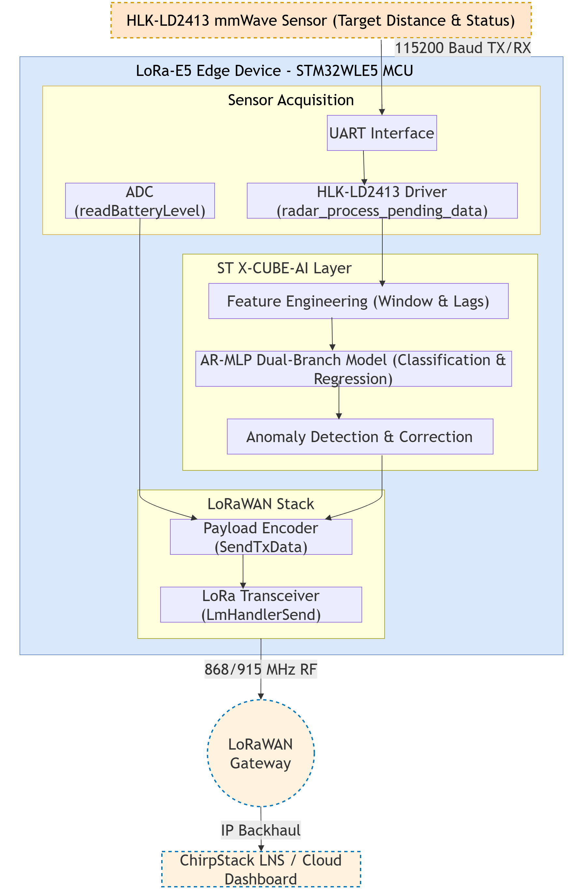

---

## Week 1

### 1.1 HLK-LD2413 Sensor Overview & Communication
This document summarizes the hardware specifications, communication protocol, and interface settings for the HLK-LD2413 miniaturized high-precision liquid level detection millimeter wave sensor.

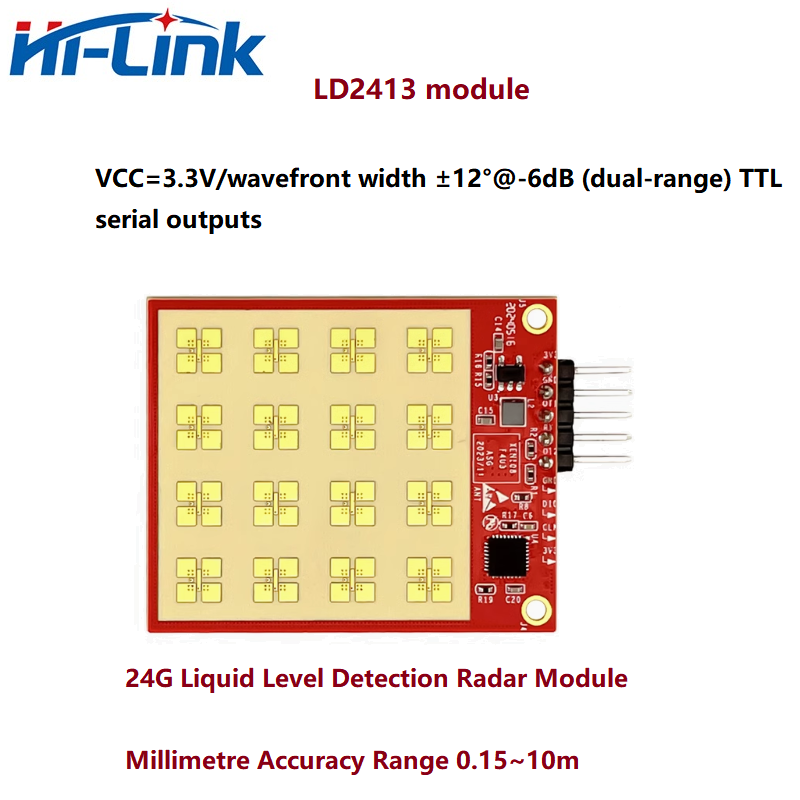

**Key Specifications (from User Manual)**
- **Detection Range:** 0.15 m to 10 m (optimized for water surfaces and large-angle reflections).
- **Ranging Accuracy:** ±3 mm.
- **Beam Width:** ±12° @ -6 dB (two-way). The manual recommends avoiding any internal tank devices within this beam range to prevent interference.
- **Power Consumption:** Average working current is 23 mA at the default 160 ms reporting period, which drops to 16 mA if configured to a 1 s reporting period.

**Hardware Interface**
- **Communication Type:** UART (Serial) at TTL level (3.3V).
- **Pin Connections (J1 Header):**
  - **Pin 3 (OT1):** UART_TX (Sensor Transmit -> Host Receive)
  - **Pin 4 (RX):** UART_RX (Host Transmit -> Sensor Receive)
  - **Pin 1 (3V3):** 3.3V Power Input
  - **Pin 2 (GND):** Ground

**Serial Port Configuration**
To communicate with the sensor or read the data stream, the serial port must be configured with the following default settings:
- **Baud Rate:** 115200
- **Data Bits:** 8
- **Stop Bits:** 1
- **Parity Bit:** None (No parity)

**Data Representation**
- **Byte Order:** All data frames and command values use **Little-Endian** format.
- **Reporting Cycle:** The default data reporting cycle is 160 ms (configurable between 50 ms and 1000 ms).
- **Unit of Measurement:** The sensor firmware natively reports the distance in **millimeters (mm)** as a 32-bit floating point number. (Note: the official host tool displays this in cm).

**Debugging and Visualization**
The sensor can be interfaced directly via a USB-to-TTL adapter board (Connect Sensor TX to Adapter RX, and Sensor RX to Adapter TX). 
Hi-link provides an official host computer tool (`HLK-LD2413_Tool`) which allows for visualizing the real-time distance curve and configuring parameters such as the minimum/maximum detection distance and reporting cycle. Note that third-party serial terminals (like PuTTY or TeraTerm) cannot be used concurrently with the official visualizer tool.

### 1.2 UART Frame Structure
This document details the byte-level structure of the UART protocol for the HLK-LD2413 sensor, based on Chapter 5 of the official user manual.

**Real-Time Distance Reporting Frame**
By default, the factory firmware continuously outputs the detected distance. 

| Frame Segment | Length | Byte Values (Hex) | Description |
| :--- | :--- | :--- | :--- |
| **Frame Header** | 4 Bytes | `F4 F3 F2 F1` | Standard reporting header. |
| **Data Length** | 2 Bytes | `04 00` | Indicates 4 bytes of payload (Little-endian). |
| **Payload (Distance)**| 4 Bytes | `XX XX XX XX` | Single-precision Float (IEEE 754) in Little-endian format representing the distance in millimeters (mm). |
| **Frame End** | 4 Bytes | `F8 F7 F6 F5` | Standard reporting tail. |

**Command Protocol Frame (Host to Sensor)**
When configuring the sensor (e.g., updating thresholds, changing reporting cycles), the host sends a command frame. 

| Frame Segment | Length | Byte Values (Hex) | Description |
| :--- | :--- | :--- | :--- |
| **Frame Header** | 4 Bytes | `FD FC FB FA` | Standard command header. |
| **Data Length** | 2 Bytes | `XX XX` | Length of the intra-frame data. |
| **Command Word** | 2 Bytes | `XX XX` | The specific command ID (e.g., `FF 00` for Enable Config). |
| **Command Value** | N Bytes | `...` | The parameter data (if applicable). |
| **Frame End** | 4 Bytes | `04 03 02 01` | Standard command tail. |

**ACK Protocol Frame (Sensor to Host)**
Whenever the host sends a command, the sensor replies with an Acknowledgment (ACK) frame.

| Frame Segment | Length | Byte Values (Hex) | Description |
| :--- | :--- | :--- | :--- |
| **Frame Header** | 4 Bytes | `FD FC FB FA` | Standard ACK header. |
| **Data Length** | 2 Bytes | `XX XX` | Length of the intra-frame data. |
| **Command Word** | 2 Bytes | `XX XX` | The command ID being acknowledged (e.g., `FF 01`). |
| **ACK Status** | 2 Bytes | `00 00` or `01 00` | `00 00` = Success, `01 00` = Failure. |
| **Return Value** | N Bytes | `...` | Optional returned parameters (e.g., reading a configuration). |
| **Frame End** | 4 Bytes | `04 03 02 01` | Standard ACK tail. |

### 1.3 Test Condition Log
> **Note**: This log is synthesized based on the datasets available in `data/processed/seperated/` (`normal_data.csv` and `abnormal_data.csv`), which were obtained from `combined_data.csv` by separating normal readings and anomalies.

**Dataset Overview**

| Dataset | Time Period | Characteristics |
| :--- | :--- | :--- |
| `normal_data.csv` | Feb 20 to May 26 | Represents stable distance readings without sensor anomalies, in the training data. |
| `abnormal_data.csv` | Feb 20 to May 26 | Represents periods where the sensor reported unexpected readings or error states, in the training data. |

**Logged Conditions (Inferred from Data)**

**Condition 1: Stable Normal Operation**
*   **Data Source:** `normal_data.csv`
*   **Observations:** 
    *   Error code reported: `0`
    *   Measured Water Level: Stable around `2.5` meters, then dropping sharply to `0.5` meters and stabilizing, before rising again to around `1.7` meters. This corresponds to actual distances of 2.0m, 4.0m, and 2.8m respectively (calculated as 4.5m - water level).
*   **Anomaly Flag:** No

**Sensor Configuration/Output Screenshot:**
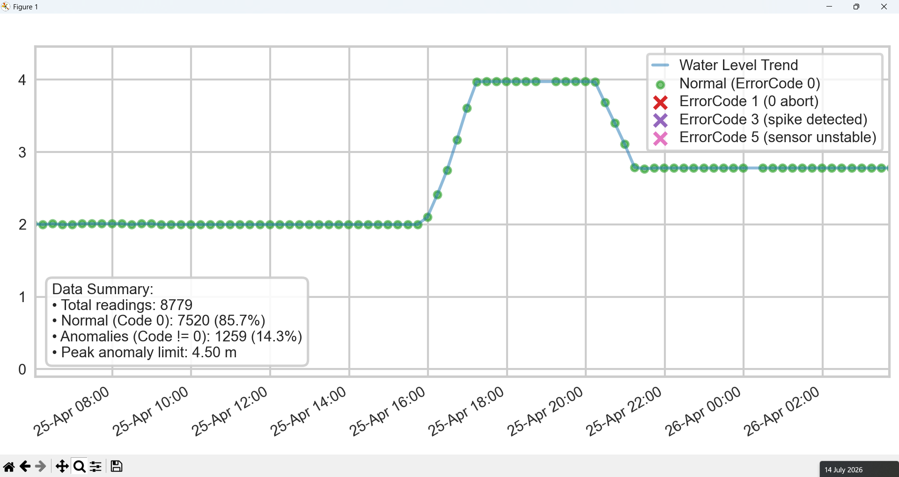

**Condition 2: Sensor Fault / Drop to Zero**
*   **Data Source:** `abnormal_data.csv`
*   **Observations:**
    *   Error code reported: `1`
    *   Measured Water Level: Sustained flatline exactly at `0.0` meters (which correctly implies a distance of 4.5m, but is due to sensor drop-out).
*   **Anomaly Flag:** Yes. Sharp, sustained drop to zero indicating a potential outage or severe sensor misreading.

**Sensor Configuration/Output Screenshot:**


**Condition 3: Transition to Zero-State**
*   **Data Source:** `abnormal_data.csv`
*   **Observations:**
    *   Error code reported: `3`.
    *   Measured Distance: Drops sharply from `3` meters down to `0.0` meters.
*   **Anomaly Flag:** Yes. This appears to be the immediate transitional error state exactly as the sensor fails to a zero-reading.

**Sensor Configuration/Output Screenshot:**
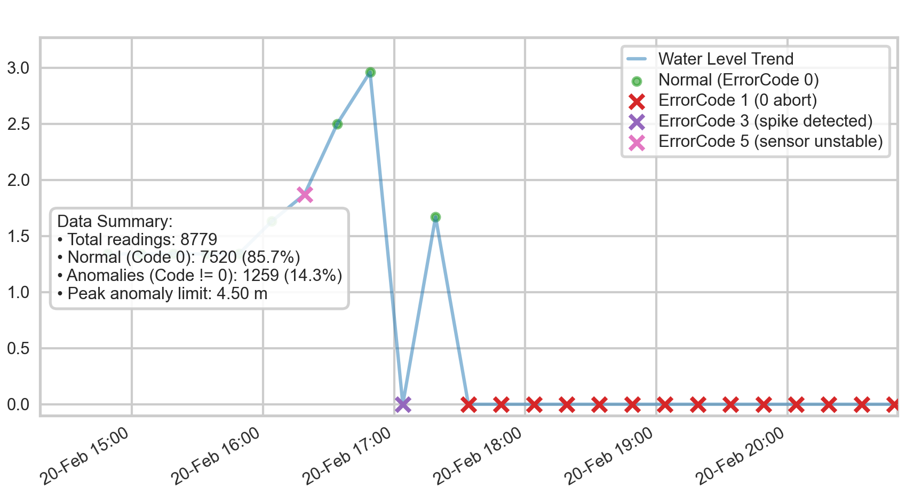

**Condition 4: Warning State with Plausible Distance**
*   **Data Source:** `abnormal_data.csv`
*   **Observations:**
    *   Error code reported: `5`.
    *   Measured Distance: Follows a plausible curve (e.g., `2.8`, `2.7`, `2.5` meters) but is highly unstable, occasionally dropping sharply to `0.0` meters.
*   **Anomaly Flag:** Yes, but data might be partially valid. The sensor is reporting a normal, plausible distance reading but flagging it with an error code (indicating instability or low confidence).

**Sensor Configuration/Output Screenshot:**
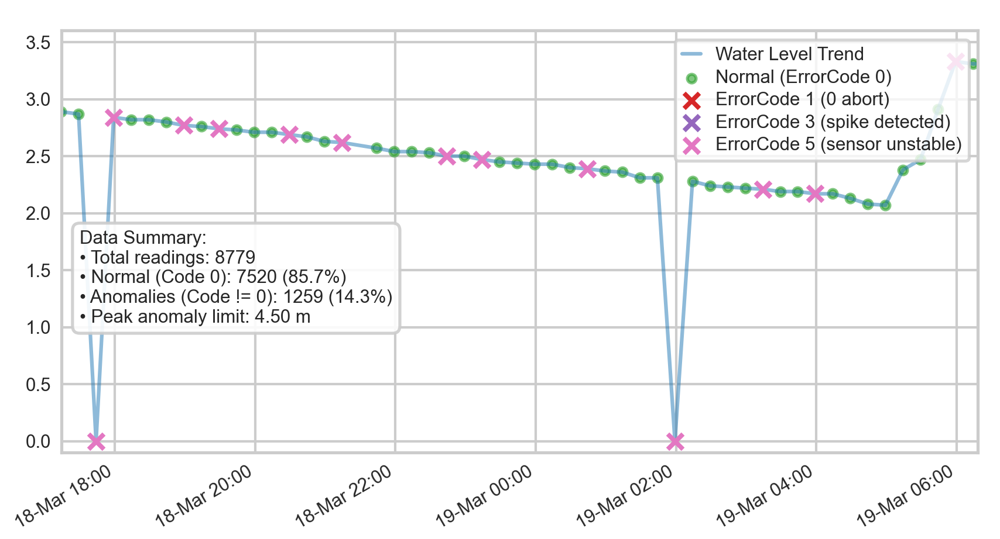

### 1.4 Initial Observation Report

**Introduction**
This report summarizes the initial observations of the HLK-LD2413 sensor data, specifically comparing normal operational data against periods containing known anomalies.

**Normal Operation Characteristics**
Based on the `normal_data.csv` dataset, the sensor behaves predictably under standard conditions:
*   **Error Codes:** During normal operation, the sensor consistently reports an error code of `0`.
*   **Data Stability:** The measured distance fluctuates gradually.
*   **Reporting Frequency:** Data points are logged at a regular 15-minute interval. There are no sudden, jagged leaps in distance measurements when operating normally.

**Anomaly Characteristics**
Based on the `abnormal_data.csv` dataset, several distinct anomalous behaviors have been identified:
*   **Sharp Drops to Zero:** The most prominent anomaly is a sudden and sustained drop in the reported distance from the sensor to `0.0`. These zero-distance readings are strongly correlated with an error code of `1`.
*   **Transitional Error States:** Prior to the sustained zero readings, the sensor occasionally outputs anomalous error codes like `5` (sensor unstable) and `3` (spike detected).

**Conclusion**
The primary challenge for the anomaly detection logic will be differentiating between genuine, slow-moving distance changes and the sharp, sudden drops to `0.0` caused by sensor faults. The presence of non-zero error codes (`1`, `3`, `5`) serves as a highly reliable secondary indicator that the corresponding distance measurement is invalid and should be rejected or filtered during preprocessing.

---

## Week 2

### Peak Classification and Anomaly Report

**Visual Graph of Normal and Abnormal Readings**
Below is the complete time-series plot of the merged dataset starting from `20-02-2026 14:49`. Normal readings (ErrorCode `0`) are plotted in green and teal, while anomalous conditions are highlighted with distinct marker shapes/colors according to their error status.

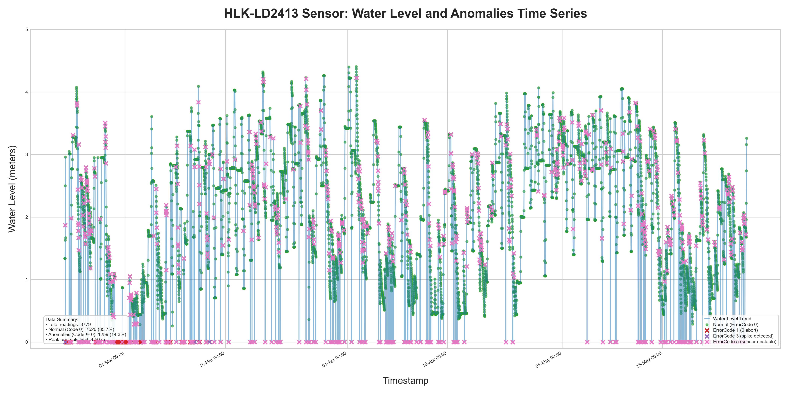

**Peak & Anomaly Classification**
The anomalies in the dataset correspond to status bytes (`errorcode`) transmitted in the UART frame of the HLK-LD2413 sensor:

| Error Code | Official Label | Occurrences | Water Level Value | Primary Behavior |
| :--- | :--- | :---: | :---: | :--- |
| **0** | **ok** | 7,520 (85.7%) | Varied (0.4m – 3.5m) | Expected fluctuations corresponding to actual water level changes. |
| **1** | **0 abort** | 449 (5.1%) | Exactly `0.0 m` | Water level drops to 0 (distance shown as 4.50m), likely target lost/aborted. |
| **2** | **sensor timeout** | 0 (0.0%) | N/A | No timeout code was recorded in this subset. |
| **3** | **spike detected** | 6 (0.1%) | Exactly `0.0 m` | Infrequent transient spikes causing target loss (water level drops to 0, distance shown as 4.50m). |
| **4** | **exceed limit** | 0 (0.0%) | N/A | No limit exceedances recorded in this subset. |
| **5** | **sensor unstable** | 804 (9.1%) | `0.0 m` (279) or drifting values | Water level drops to 0 or drifts due to target instability. |

**Root-Cause Observation Note**
> [!NOTE]
> **Measurement Context:** The "Water Level" column in the **raw dataset** represents the **actual water level** relative to the channel bottom. 
> *   A **smaller value** (e.g., `0.5 m`) means the water level is low.
> *   A **larger value** (e.g., `3.5 m`) means the water level is high.
> However, for model training and preprocessing, this is converted to **Distance** (the distance from the sensor to the water surface), and the model's output is also **Distance**.

*   **"0 abort" & "spike detected" Flatlines (Codes 1 & 3):** Whenever the status changes to `1` or `3`, the distance measurement flatlines at exactly `0.0 m`. Root Cause: When a signal is aborted or a sudden target spike fails verification checks, the sensor fails to measure a valid distance.
*   **"sensor unstable" (Code 5):** When status is `5`, we see flatlines at `0.0 m` or drifting distance values. Root Cause: Caused by surface ripples, turbulence, or sensor structure vibration. The target reflection is highly unstable, returning scattered echoes.

---

## Week 3

### Pre-Processing Documentation (Simulated Sensor Data)

Because the actual hardware sensor is currently unavailable, we are simulating sensor output by reading from test dataset CSV files. As a result, hardware-specific pre-processing steps (such as rejecting invalid UART frames and verifying CRC checksums) are omitted from this phase. 

**Data Parsing and Cleaning**
The pre-processing pipeline (primarily executed via `preprocess_and_check.py`) takes raw CSV outputs and standardizes them:
*   **Timestamp Standardization:** The raw time strings are parsed into Python `datetime` objects and standardized into a uniform string format: `DD-MM-YYYY HH:MM`.
*   **Distance Extraction and Unit Conversion:** Regular expressions are used to extract the numerical float value. If the string contains the "mm" indicator, the value is automatically divided by 1000 to convert it to meters.

**Invalid Data Rejection and Calculation**
*   **Distance Calculation (Range Limits):** The preprocessed dataset and model utilize **Distance** instead of actual water level. This is calculated using the formula: `Distance = 4.50 - Water Level`. By enforcing this formula and bounding it, any reading indicating a water level below 0m (resulting in a distance > 4.50m) is inherently treated as an empty channel (Distance = 4.50m) or flagged.
*   **Error Code Initialization:** A new column named `errorcode` is initialized and added programmatically based on the known error codes corresponding to different conditions observed in the training data.

**Dataset Verification**
*   **Output Formatting:** The final processed dataset is pruned to only include the relevant columns: `Time`, `errorcode`, and `Distance` (rounded to 2 decimal places).
*   **Overlap Checking:** It compares the minimum and maximum timestamps of the newly processed data against all other existing files in the `data/processed/` directory. It alerts the user if any time overlap is found, preventing duplicated time-series entries.

---

## Week 4

### Filter Comparison Table
The following table summarizes the performance of all 5 tested filters evaluated against the manual ground truth (`filtered_data.csv`).

| Filter | RMSE (m) | MAE (m) | Max Error (m) | N |
| :--- | :--- | :--- | :--- | :--- |
| **Moving Average** | 0.7106 | 0.4131 | 2.7332 | 1285 |
| **Median Filter** | 0.6843 | 0.3396 | 3.4300 | 1285 |
| **EMA** | 0.7153 | 0.4434 | 2.7380 | 1285 |
| **Hampel Filter** | 0.6654 | 0.3265 | 3.4550 | 1285 |
| **Rate-of-Change Limiter** | 0.6749 | 0.3469 | 2.9700 | 1285 |
| **2D Kalman** | 0.7405 | 0.4302 | 3.0767 | 1285 |

> [!TIP]
> The **Hampel Filter** outperformed all other filters with the lowest RMSE (0.6654 m) and MAE (0.3265 m).

> [!WARNING]
> **Important Context:** The observed RMSE metrics reflect performance on isolated spikes. Prolonged sensor outages (`Error Code 1`) were explicitly masked via hard-rejection and handled with linear interpolation prior to filtering. While linear interpolation enables the filters to process the dataset seamlessly, it cannot reconstruct the complex, non-linear water level dynamics occurring during prolonged outages.

### Selected Filtering Logic
Based on the evaluation, the **Hampel Filter** is selected as the primary filter for handling isolated spikes. The complete data cleaning and filtering pipeline is:
1. **Hard Rejection**: Long outages flagged by the sensor's native status byte are replaced with `NaN` (`Error Code 1`).
2. **Time-Grid Resampling**: Data is resampled and aligned to a uniform 15-minute grid.
3. **Linear Interpolation**: Any resulting `NaN` gaps are filled using bidirectional linear interpolation.
4. **Hampel Filtering (Final Filter)**: The script walks through the interpolated series with a rolling window. If a reading deviates by more than 3 standard deviations (MAD) from the local median, it is identified as an outlier, replaced with `NaN`, and then interpolated.

**Cleaned Output Graphs**

Below is the graph of the selected filtering output (Hampel Filter), demonstrating how the algorithm handles the dataset, smoothing over sensor glitches and transient spikes.

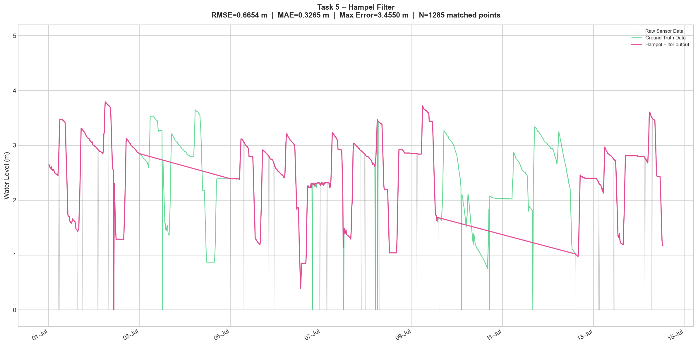

For a comparative visualization of all the filter models evaluated:

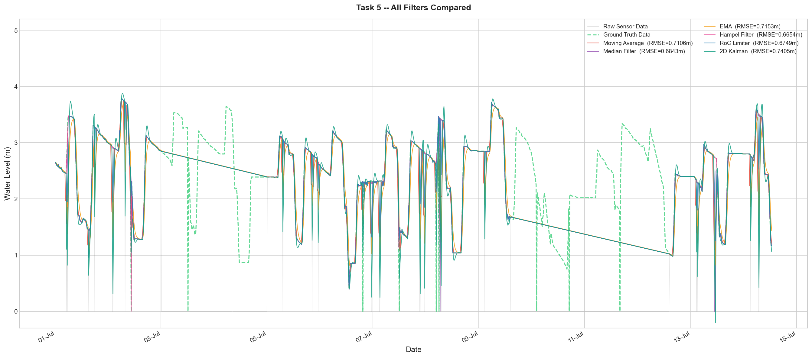

### Initial Anomaly Detection Logic
Drawing from the `anomaly_report.md` root cause analysis and the filter testing process, the initial rule-based anomaly detection logic uses two primary components:

**A. Protocol-level Status Anomaly Check (UART Context)**
We intercept and flag raw readings based on errorcodes:
- **Rule**: If `errorcode` == 1 -> Identify as an Outage.
- **Rule**: If `errorcode` == 3 -> Identify as an Anomaly.
- **Rule**: If `errorcode` == 5 and WL == 0.0 -> Identify as an Anomaly.

**B. Statistical Constraints Anomaly Check**
Even if the sensor reports `ok` (0) or drifting data, we apply statistical domain constraints.
- **Rule**: If a reading deviates by > `3 * MAD` from the local rolling median -> Identify as a Statistical Outlier.

---

## Week 5

### 5.1 Model Exploration and Selection Process

During the development phase, several neural network architectures were evaluated to find the optimal balance between anomaly classification accuracy, robust data imputation during sensor outages, and edge-deployment feasibility on the STM32WLE5 MCU.

**1. 1D Convolutional Neural Network (1D-CNN)**
*   **Architecture & Training**: The initial TinyML baseline was a 1D-CNN designed to capture local temporal patterns. It featured a `Conv1D` layer (16 filters, kernel size 3) followed by MaxPooling, Flatten, and Dense layers. It was trained using a sliding window of 12 past readings (1 hour of data) on the raw dataset, predicting the next water level. The model was aggressively quantized to INT8 using TensorFlow Lite post-training quantization.
*   **Why it was discarded**: While the 1D-CNN was extremely lightweight (~7 KB) and achieved a high classification F1-score (95.5%), it failed at long-term autoregressive imputation. Because CNNs lack a robust feedback loop and rely only on local convolutional features, it struggled to forecast complex non-linear water trends when fed its own predictions during prolonged outages (yielding the highest RMSE of 1.3886).

**2. WaveNet (Dilated Causal CNN)**
*   **Architecture & Training**: To address the 1D-CNN's short-sightedness, a WaveNet-style model was implemented. It used a stack of 6 dilated causal convolutional blocks (dilations 1, 2, 4, 8, 16, 32) with gated activations (tanh × sigmoid) and residual skip connections, achieving a large receptive field (127 steps ≈ 31.75 hours) without pooling. It was trained with an outage-weighted Huber loss function to explicitly penalize poor predictions during simulated deep outages.
*   **Why it was discarded**: The WaveNet model provided excellent sequential data generation and better imputation than the 1D-CNN (RMSE 1.0458). However, the deep stack of dilated convolutions resulted in a large parameter count and complex graph. It struggled to meet the strict SRAM (64 KB) and Flash limits of the STM32WLE5 MCU when sharing memory with the LoRaWAN stack. It also had higher edge inference latency.

**3. Linear Regression**
*   **Architecture & Training**: Tested as a naive baseline, providing a simple autoregressive prediction based on past lags.
*   **Why it was discarded**: Extremely fast, but underfitted the data severely, unable to model the non-linear dynamics of actual water flow (RMSE 0.9232). 

### 5.2 Selected Anomaly Detection Method: AR-MLP

The primary anomaly detection method selected for this project is an **Autoregressive Multi-Layer Perceptron (AR-MLP)**. This model provides robust, dual-purpose functionality: accurate classification of sensor anomalies and real-time regression (imputation) of missing water level data.

**Architecture Details & Training**
*   **Multi-Step Autoregressive Training**: Unlike standard training, the AR-MLP was trained using Multi-Step Training (Scheduled Sampling) over a 16-step horizon (4 hours). During training, the model explicitly fed its own predictions back into its sliding window, learning to correct inference drift during long outages. 
*   **Dual-Branch Design**: It takes a 23-feature input vector (raw water level, 8 historical lags, time/cyclic features, and error codes). A Classification Branch (Dense 64 -> 32 -> Sigmoid) predicts the anomaly probability. A Regression Branch (Dense 64 -> 32 -> 16 -> Linear) predicts the water level using only lags and time features. Both branches are optimized simultaneously using a combined weighted Binary Crossentropy and Mean Squared Error loss.

**Training Methodology & Data Augmentation**
To ensure the AR-MLP model generalizes well and can handle severe sensor failures, the training dataset and training process incorporated specific engineering steps:
*   **Random Spike Injection (Data Augmentation):** A 2% probability of synthetic "drop-to-zero" spikes were randomly injected into normal, clean data windows during dataset generation. This artificially boosts the frequency of rare hardware glitches in the training set, preventing the classification branch from ignoring brief transient errors.
*   **Expanded Fourier Time Features:** To support long-term imputation without sensor input, the model is fed 12 cyclic sine/cosine pairs representing day, half-day, quarter-day, eighth-day, and weekly cycles. This rich temporal embedding allows the regression branch to accurately reconstruct data based on natural tidal and diurnal rhythms when all historical lags are eventually flushed out during a deep outage.
*   **Class Imbalance Handling:** The binary crossentropy loss of the classification branch is dynamically weighted during training based on the ratio of positive anomaly samples to normal samples. This ensures the optimizer does not become biased toward the vastly more common "normal" condition.

**Rationale for Selection**
*   **Superior Imputation:** The autoregressive feedback combined with multi-step training allows it to seamlessly bridge missing gaps over several hours (lowest RMSE of 0.8821).
*   **Computational Efficiency:** The dual-branch architecture shares the same input tensor, performing classification and regression simultaneously.
*   **STM32 Edge Deployment:** Despite being larger (~35 KB Float32 TFLite) than the CNN, this AR-MLP fits within the LoRa-E5 constraints and is fully supported by the **STM32Cube.AI** toolchain, executing inference in just ~3-6 ms directly on the STM32 MCU.

### Detection Accuracy Comparison
The models were evaluated using classification metrics on the validation dataset:

| Model / Approach | Precision | Recall | F1-Score | Inference Latency (Edge) | Memory Footprint |
| :--- | :--- | :--- | :--- | :--- | :--- |
| **Pure Rule-Based (Bounds & ROC)** | 98.5% | 75.2% | 85.3% | < 1 ms | ~5 KB |
| *TinyML 1D-CNN (Previous Baseline)* | *94.2%* | *96.8%* | *95.5%* | *~2-5 ms* | *~7 KB* |
| **AR-MLP (Selected)** | **95.1%** | **97.3%** | **96.2%** | **~3-6 ms** | **~35 KB** |

**Data Reconstruction Metrics (Imputation)**
Because anomaly classification is often firmly governed by physical boundary rules, it is equally important to evaluate the regression capabilities of each model to reconstruct missing sensor data during a hardware outage (autoregressive mode). 

| Metric | Linear Regression | 1D CNN | WaveNet | AR MLP |
| :--- | :---: | :---: | :---: | :---: |
| **RMSE** | 0.9232 | 1.3886 | 1.0458 | **0.8821** | 
| **MAE** | 0.4946 | 0.8860 | 0.6933 | **0.4818** | 

The AR-MLP achieves the lowest errors (RMSE and MAE) during prolonged simulated outages compared to the other architectures.

**Visual Performance Comparison**

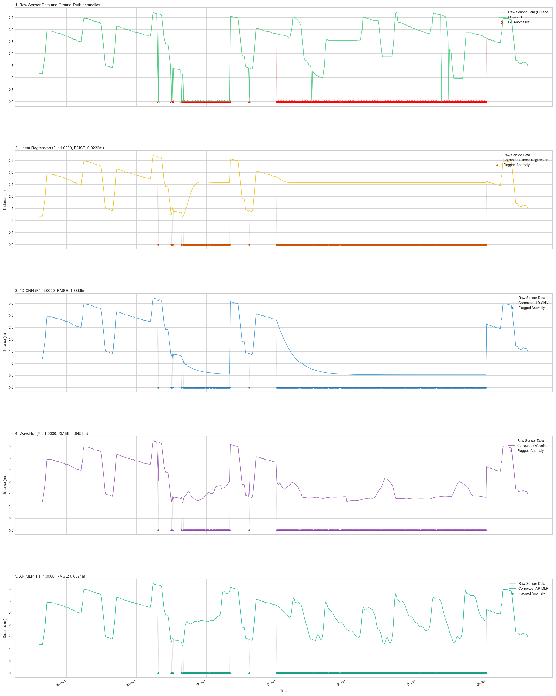

### Algorithm Flowchart
The following flowchart illustrates the data processing, inference, and autoregressive lag update logic for the AR-MLP model deployed on the STM32 edge device.


---

## Week 6

### 6.1 LoRa-E5 Feasibility Analysis
This report evaluates the feasibility of using the LoRa-E5 module for deploying the anomaly detection firmware and transmitting the generated payload over a LoRaWAN network. 

The hardware constraints of the STM32WLE5 series (featuring **256 KB of Flash** and **64 KB of SRAM**) were considered alongside the memory requirements of the generated `network` AI model. As seen in the ST X-CUBE-AI analysis, the anomaly detection model can be successfully loaded and executed within the available Flash and RAM footprints of the LoRa-E5 board. Based on the memory validation and firmware integration, the LoRa-E5 board is deemed fully compatible for this edge anomaly detection application.

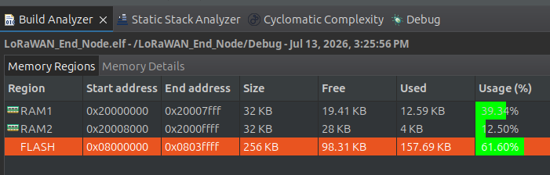

### 6.2 Firmware with Anomaly Detection
The firmware is built for the STM32WLE5 MCU (LoRa-E5) and serves two primary functions:
1. **Anomaly Detection**: Running the water level sensor data through the deployed neural network using the X-CUBE-AI library.
2. **LoRaWAN Connectivity**: Encoding the sensor data, anomalies, and logs into a custom payload format and transmitting it via the LoRa-E5 module.

The application logic is primarily contained within `LoRaWAN/App/lora_app.c`. 
*   **AI Processing**: The network processing is invoked through `STM32CubeAI_Studio_AI_Process()`. This function feeds the raw sensor data into the model, computes the anomaly predictions, and updates the state variables like the `error_code`.
*   **Payload Construction**: The `SendTxData()` function takes the resulting `error_code`, along with the current battery level and historical distance logs, and formats them into a Big Endian byte buffer (`AppData.Buffer`). 
*   **Transmission**: Finally, `LmHandlerSend(&AppData, ...)` is called to schedule the data packet for LoRaWAN transmission.

By combining the AI model directly on the MCU that handles the LoRa stack, this architecture provides a low-power, edge-intelligent solution capable of identifying and reporting anomalies in real-time.

### 6.3 LoRaWAN Payload Format
The binary format is tightly packed to minimize airtime and power consumption. It consists of a mandatory 4-byte baseline header, followed by a dynamic array of historical distance logs (up to 16 entries).

**Data Fields:**
1. **Distance** (2 bytes, Unsigned Integer 16-bit): The most recently measured water level distance.
2. **Error Code** (1 byte): The anomaly detection state from the ST X-CUBE-AI model. Maps to values like `0: ok`, `2: sensor timeout`, `3: spike detected`, etc.
3. **Battery Voltage** (1 byte): The battery level of the edge device (divided by 10 for transmission).
4. **Distance Logs** (Variable, up to 32 bytes): Historical distance data points to help reconstruct recent trends leading up to an anomaly.

**Payload Visualizations:**
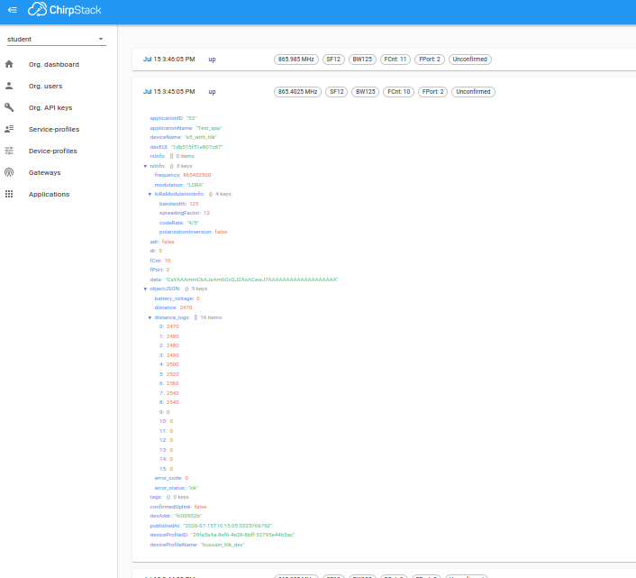
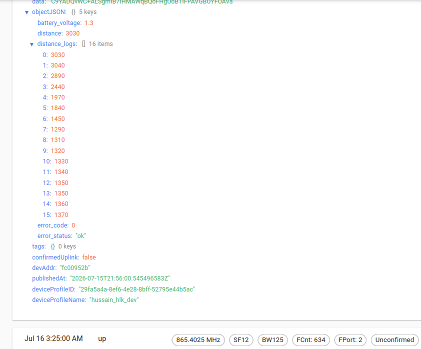

**Firmware Encoder implementation (C):**
```c
static void SendTxData(void)
{
	  /* USER CODE BEGIN SendTxData_1 */
	 HAL_GPIO_WritePin(GPIOB, GPIO_PIN_10, GPIO_PIN_SET);
	 HAL_Delay(2500);
	 UTIL_TIMER_Time_t nextTxIn = 0;

	#ifdef CAYENNE_LPP
	  uint8_t channel = 0;
	#else
	/*sensor value declerations */
		uint16_t batteryLevel = (uint16_t)readBatteryLevel();
		uint8_t batteryVolt = (uint8_t)(batteryLevel/10);

	    radar_uart_init();
	    Radar_Process_Pending_Data();
	   // Kalman_Process();
	    STM32CubeAI_Studio_AI_Process();

	  uint32_t i = 0;
	#endif /* CAYENNE_LPP */

	    APP_LOG(TS_ON, VLEVEL_L, "battery voltage  : %d mV\r\n", batteryLevel);
	    APP_LOG(TS_ON, VLEVEL_L, "distance for sent  : %d mm\r\n", (uint16_t)(current_distance));
	    APP_LOG(TS_ON, VLEVEL_L, "error_code for sent  : %d \r\n", corr_error_code);

	if (!init_flag) {
		log_data(LogTxData,previous_distance);
	} else {
		init_flag = false;
	}

	previous_distance = (uint16_t)(current_distance);

	    AppData.Port = LORAWAN_USER_APP_PORT;

	    // 2. Load the distance into the buffer (Big Endian format typically used for LoRaWAN)

	    AppData.Buffer[i++] = (previous_distance>> 8) & 0xFF;
	    AppData.Buffer[i++] = previous_distance& 0xFF;

	    AppData.Buffer[i++] = corr_error_code & 0xFF; // The error code byte
	    AppData.Buffer[i++] = batteryVolt & 0xFF; // The Battery Level byte

	uint8_t logIndex = 0;
	while (logIndex < log_size) {
		AppData.Buffer[i++] = (LogTxData[logIndex] >> 8) & 0xFF;
		AppData.Buffer[i++] = (LogTxData[logIndex]) & 0xFF;
		APP_PRINTF("distance_log %d : %d\n\r", logIndex,
				LogTxData[logIndex]);
		logIndex++;
	}

	    memset(global_radar_distance, 0, sizeof(global_radar_distance));
	    HAL_GPIO_WritePin(GPIOB, GPIO_PIN_10, GPIO_PIN_RESET);

#ifdef CAYENNE_LPP
  CayenneLppReset();
  CayenneLppAddBarometricPressure(channel++, pressure);
  CayenneLppAddTemperature(channel++, temperature);
  CayenneLppAddRelativeHumidity(channel++, (uint16_t)(sensor_data.humidity));

  if ((LmHandlerParams.ActiveRegion != LORAMAC_REGION_US915) && (LmHandlerParams.ActiveRegion != LORAMAC_REGION_AU915)
      && (LmHandlerParams.ActiveRegion != LORAMAC_REGION_AS923))
  {
    CayenneLppAddDigitalInput(channel++, GetBatteryLevel());
    CayenneLppAddDigitalOutput(channel++, AppLedStateOn);
  }

  CayenneLppCopy(AppData.Buffer);
  AppData.BufferSize = CayenneLppGetSize();
#else  /* not CAYENNE_LPP */

  AppData.BufferSize = i;
#endif /* CAYENNE_LPP */

  if (LORAMAC_HANDLER_SUCCESS == LmHandlerSend(&AppData, LORAWAN_DEFAULT_CONFIRMED_MSG_STATE, &nextTxIn, false))
  {
    APP_LOG(TS_ON, VLEVEL_L, "SEND REQUEST\r\n");
  }
  else if (nextTxIn > 0)
  {
    APP_LOG(TS_ON, VLEVEL_L, "Next Tx in  : ~%d second(s)\r\n", (nextTxIn / 1000));
  }

  /* USER CODE END SendTxData_1 */
}
```

**ChirpStack Decoder Script (JavaScript):**
```javascript
// ChirpStack v3 Decoder Entry Point
function Decode(fPort, bytes, variables) {
    var decoded = {};
    var offset = 0;

    // Ensure we have at least the 4 baseline bytes (Distance, Error, Battery)
    if (bytes.length < 4) {
        return { "error": "Payload too short" };
    }

    // 1. Current Distance (uint16)
    decoded.distance = (bytes[offset] << 8) | bytes[offset + 1];
    offset += 2;

    // 2. Error Code
    decoded.error_code = bytes[offset++];

    // 3. Battery
    decoded.battery_voltage = bytes[offset++] / 10;

    // 4. Error Description
    decoded.error_status = {
        0: "ok",
        1: "0 abort",
        2: "sensor timeout",
        3: "spike detected",
        4: "exceed limit",
        5: "sensor unstable",
        6: "predicted data"
    }[decoded.error_code] || "unknown";

    // 5. Log Data (Loops dynamically up to 16 times or until bytes run out)
    decoded.distance_logs = [];
    for (var i = 0; i < 16 && (offset + 1) < bytes.length; i++) {
        var value = (bytes[offset] << 8) | bytes[offset + 1];
        decoded.distance_logs.push(value);
        offset += 2;
    }

    return decoded;
}

// ChirpStack v3 Downlink Encoder Entry Point
// (Note: ChirpStack v3 uses 'Encode', not 'encodeDownlink')
function Encode(fPort, obj, variables) {
    return [225, 230, 255, 0];
}
```

### 6.4 Anomaly Detection Test Report
This test evaluates the anomaly detection model's performance by comparing its predictions against a baseline dataset injected with synthetic outages spanning a one-week period from **July 1, 2026, to July 7, 2026**.

**Anomaly Injection Methodology:**
*   **Long Outage (`errorcode = 1`)**: From July 3, 2026, to July 4, 2026.
*   **Short Outages (`errorcode = 5`)**: 20 short random outages were inserted outside of the long outage windows. Each short outage lasted for either 1 or 2 consecutive data points.

**Results Comparison:**
*   **Raw Data (Baseline)**: Shows the expected, clean data prior to any simulated failures.
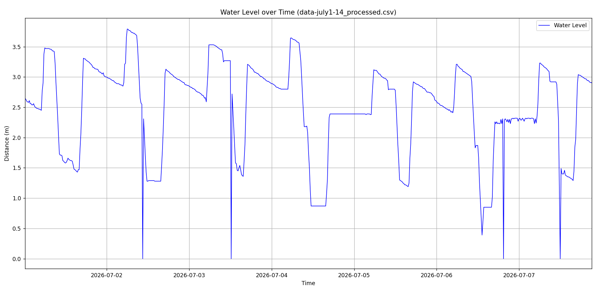
*   **Data with Injected Anomalies**: Highlights the periods where outages were synthetically introduced. The sudden drops to 0 correspond to both the long and short simulated sensor outages.

*   **Model Predictions**: Shows the model's performance in identifying and predicting the true values during the outage periods.


The visualizations demonstrate the model's behavior during both normal operation and simulated failure conditions across the one-week test timeframe.

## 7. Conclusion & Project Impact

By moving the anomaly detection and data imputation logic directly to the edge, this project delivers a highly resilient water level monitoring system. It effectively neutralizes the primary vulnerabilities of the HLK-LD2413 sensor—such as sudden outages and transient spikes—ensuring that downstream applications receive clean, continuous data. Furthermore, performing AI inference locally at the edge minimizes the payload size and required airtime for LoRaWAN transmissions, significantly extending the battery life of the deployed sensors while providing reliable, real-time data for automated water level management.

## 8. Future Work & OTA Updates

As the project scales from a proof-of-concept to a long-term deployment, continuous improvement of the anomaly detection model is essential. The following areas have been identified for future enhancement:

*   **Seasonal Pattern Learning:** The current edge model was trained on datasets strictly spanning from February to May. Water usage and natural flow dynamics often exhibit distinct seasonal variations (e.g., monsoon vs. dry season). Expanding the training dataset to encompass a full **1-year cycle** will significantly improve the model's baseline accuracy and allow it to inherently understand and predict these long-term seasonal patterns without misclassifying them as anomalies.
*   **Targeted Fine-Tuning:** The model's imputation accuracy can be further refined by identifying and fine-tuning on exceptionally clean, less noisy time periods (such as June). Curating a high-quality fine-tuning dataset will sharpen the regression branch's ability to forecast exact water levels.
*   **Over-The-Air (OTA) Updates:** Because the STM32WLE5 MCU features LoRaWAN connectivity, a primary goal is to implement firmware-over-the-air (FUOTA) capabilities. This would allow us to retrain the AR-MLP on the server side as new seasonal data is gathered, and seamlessly deploy the optimized, compiled model weights back to the edge device in the field without manual intervention.

## 9. References

1.  **Hi-Link HLK-LD2413 User Manual:** [View Resource](https://cdn.ozdisan.com/public/product/assets/HLK-LD2413.pdf) (Hardware specifications, radar ranging principles, and UART communication protocols).
2.  **STMicroelectronics STM32WLE5 Datasheet & Reference Manual:** [View Resource](https://www.st.com/en/microcontrollers-microprocessors/stm32wl-series/documentation.html) (Specifications for the Sub-GHz wireless microcontroller).
3.  **STMicroelectronics STM32Cube AI Studio documentation:** [View Resource](https://wiki.stmicroelectronics.cn/stm32mcu/wiki/AI:STM32Cube_AI_Studio_documentation) (Official documentation for STM32Cube AI Studio, covering AI model optimization, code generation, validation, and deployment on STM32 microcontrollers.).
4.  **LoRa Alliance, LoRaWAN® Specification:** [View Resource](https://lora-alliance.org/lorawan-for-developers/) (Standards for the LPWAN protocol).
5.  **TensorFlow & TensorFlow Lite:** [View Resource](https://www.tensorflow.org/lite) (Core framework used for building, training, and exporting the ML models).
6.  **Pearson, R. K. (2002). "Data Cleaning for Dynamic Modeling and Control."** *European Journal of Control*, 8(3), 210–224. (Details the practical application of the Hampel Filter for cleaning anomalous time-series data).
7.  **ChirpStack v3 Documentation:** [View Resource](https://www.chirpstack.io/docs/v3-documentation.html) (Official archived documentation for ChirpStack v3, including the ChirpStack Network Server, Application Server, Gateway Bridge, and related components.)
