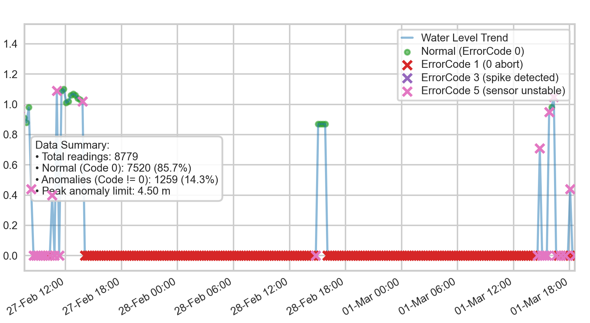

# Test Condition Log

> **Note**: This log is synthesized based on the datasets available in `data/processed/seperated/` (`normal_data.csv` and `abnormal_data.csv`), which were obtained from `combined_data.csv` by separating normal readings and anomalies.

## Dataset Overview

| Dataset | Time Period | Characteristics |
| :--- | :--- | :--- |
| `normal_data.csv` | Feb 20 to May 26 | Represents stable distance readings without sensor anomalies, in the training data. |
| `abnormal_data.csv` | Feb 20 to May 26 | Represents periods where the sensor reported unexpected readings or error states, in the training data. |

## Logged Conditions (Inferred from Data)

### Condition 1: Stable Normal Operation
*   **Data Source:** `normal_data.csv`
*   **Time Example:** 25-Apr 08:00 to 26-Apr 02:00
*   **Observations:** 
    *   Error code reported: `0`
    *   Measured Water Level: Stable around `2.5` meters, then dropping sharply to `0.5` meters and stabilizing, before rising again to around `1.7` meters. This corresponds to actual distances of 2.0m, 4.0m, and 2.8m respectively (calculated as 4.5m - water level).
*   **Anomaly Flag:** No

**Sensor Configuration/Output Screenshot:**

### Condition 2: Sensor Fault / Drop to Zero
*   **Data Source:** `abnormal_data.csv`
*   **Time Example:** 27-Feb 18:00 to 01-Mar 12:00
*   **Observations:**
    *   Error code reported: `1`
    *   Measured Water Level: Sustained flatline exactly at `0.0` meters (which correctly implies a distance of 4.5m, but is due to sensor drop-out).
*   **Anomaly Flag:** Yes. Sharp, sustained drop to zero indicating a potential outage or severe sensor misreading.

**Sensor Configuration/Output Screenshot:**

### Condition 3: Transition to Zero-State
*   **Data Source:** `abnormal_data.csv`
*   **Time Example:** 20-Feb 17:00
*   **Observations:**
    *   Error code reported: `3`.
    *   Measured Distance: Drops sharply from `3` meters down to `0.0` meters.
*   **Anomaly Flag:** Yes. This appears to be the immediate transitional error state exactly as the sensor fails to a zero-reading.

**Sensor Configuration/Output Screenshot:**

### Condition 4: Warning State with Plausible Distance
*   **Data Source:** `abnormal_data.csv`
*   **Time Example:** 18-Mar 18:00 to 19-Mar 06:00
*   **Observations:**
    *   Error code reported: `5`.
    *   Measured Distance: Follows a plausible curve (e.g., `2.8`, `2.7`, `2.5` meters) but is highly unstable, occasionally dropping sharply to `0.0` meters.
*   **Anomaly Flag:** Yes, but data might be partially valid. The sensor is reporting a normal, plausible distance reading but flagging it with an error code (indicating instability or low confidence).

**Sensor Configuration/Output Screenshot:**

