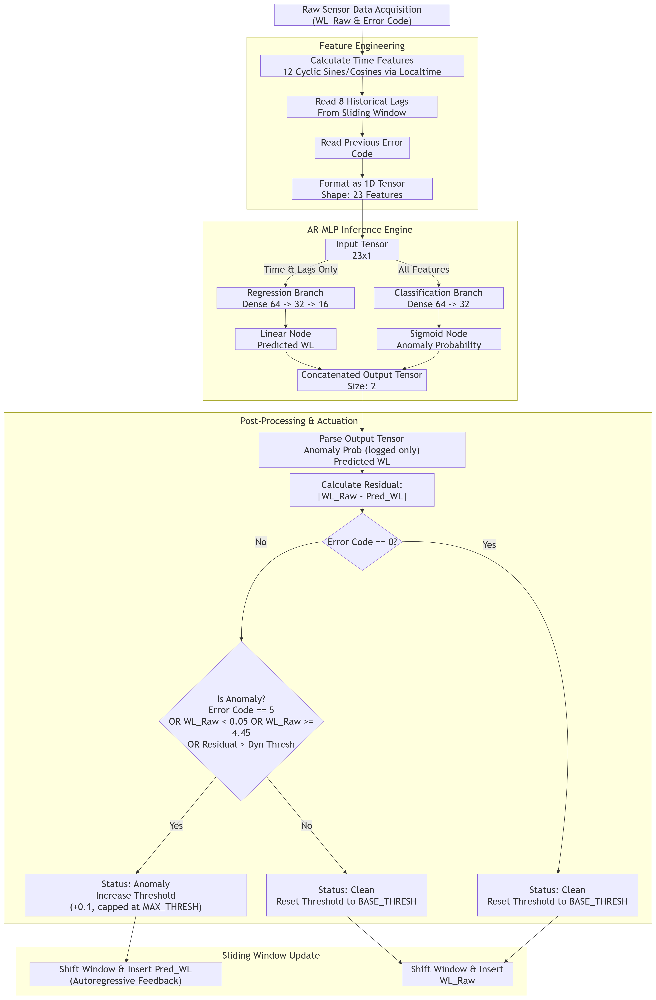

# Anomaly Detection Pipeline Flowchart

The following flowchart illustrates the data processing, inference, and autoregressive lag update logic for the AR-MLP model deployed on the STM32 edge device.

