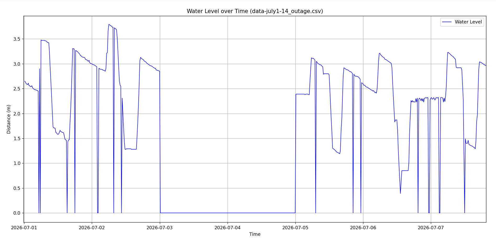
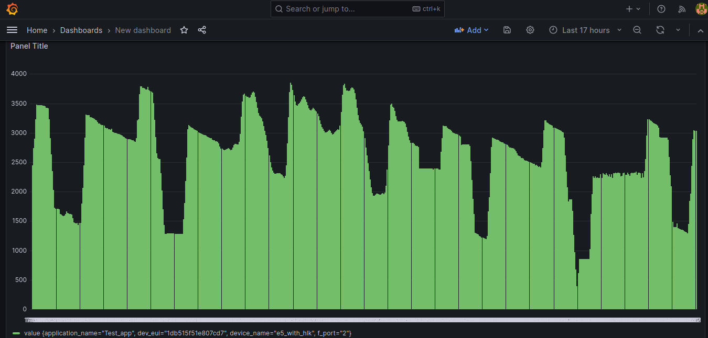

# Anomaly Detection Test Report

## 1. Test Overview

This test report evaluates the anomaly detection model's performance by comparing its predictions against a baseline dataset injected with synthetic outages. 

**Test Timeframe:** 
The underlying data for these plots spans a one-week period from **July 1, 2026, to July 7, 2026**, derived from the processed dataset.

## 2. Anomaly Injection Methodology

Based on the `inject_outages.py` script, two types of anomalies were injected to simulate sensor failure or data loss (setting the Water Level to 0):

*   **Long Outage (`errorcode = 1`)**:
    *   **Outage :timeframe:** From July 3, 2026, to July 4, 2026.
*   **Short Outages (`errorcode = 5`)**:
    *   20 short random outages were inserted outside of the long outage windows. Each short outage lasted for either 1 or 2 consecutive data points.

## 3. Results Comparison

Below is the visual comparison showing the raw data, the data after injecting the anomalies, and the model's predictions.

### Raw Data (Baseline)
This plot shows the expected, clean data prior to any simulated failures.

### Data with Injected Anomalies
This plot highlights the periods where outages were synthetically introduced based on the methodology described above. The sudden drops to 0 correspond to both the long and short simulated sensor outages.

### Model Predictions
This plot shows the model's performance in identifying and predicting the true values during the outage periods. 

## 4. Conclusion
The visualizations demonstrate the model's behavior during both normal operation and simulated failure conditions across the one-week test timeframe.
